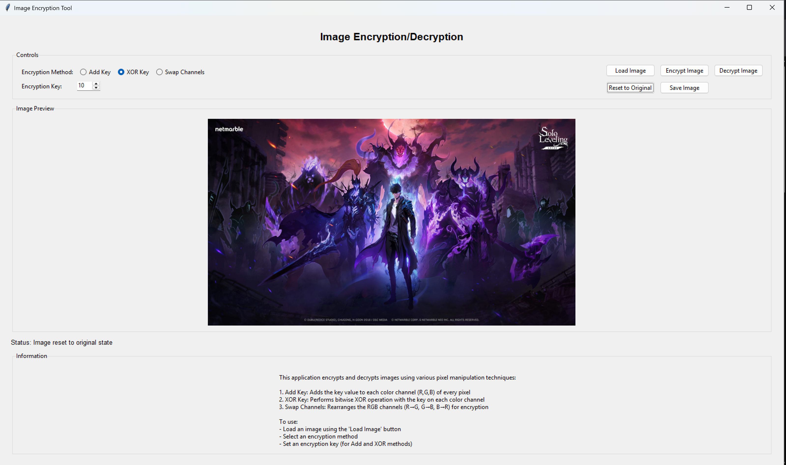

# PRODIGY_CS_02

# 🛡️ Image Encryptor

## 🔒 Secure & Protect Your Images Using Pixel Manipulation
The **Image Encryption Tool** is a powerful, user-friendly application designed to **encrypt and decrypt images** effortlessly. Built with **Python and Tkinter**, this tool ensures your sensitive images remain safe from unauthorized access.

---

##  Features
✔️ **One-Click Encryption & Decryption** for seamless security  
✔️ **User-Friendly GUI** for easy operation  
✔️ **Supports Multiple Image Formats** (PNG, JPG, JPEG)  
✔️ **Instant Success Notifications** on encryption & decryption  
✔️ **Lightweight & Fast Processing**  

---

##  Get Started
### 1️⃣ Clone the Repository  
```sh
 git clone https://github.com/MuhdSulthan/PRODIGY_CS_02.git
 cd PRODIGY_CS_02
```
### 2️⃣ Install Dependencies  
```sh
 pip install tkinter
```
### 3️⃣ Run the Application  
```sh
 python image_encryptor.py
```

---

## 📸 Preview
🔹 **Application**  
 
